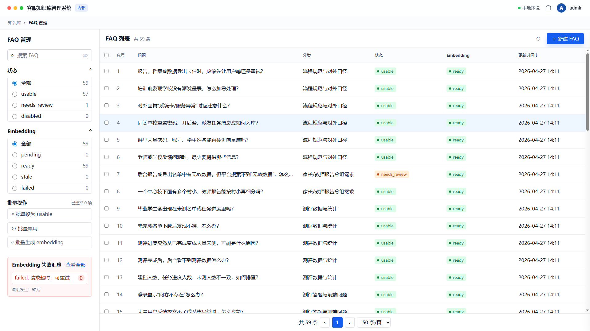
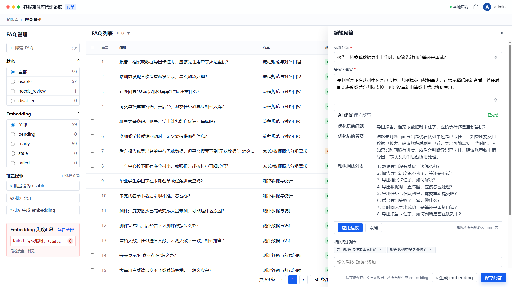

# Customer Service Agent

本项目是本地客服知识库与 RAG 服务，用于管理标准 FAQ、导入业务材料、生成候选问答，并通过 PostgreSQL + pgvector 做知识检索。

当前重点是“文件导入审核中心”：上传资料后先解析和切块，再由 AI 自动识别 FAQ，用户审核编辑后才保存到标准问答。保存 FAQ 和生成 embedding 是两个独立步骤，未审核内容不会直接进入检索。

## 核心能力

- FAQ 管理：新增、编辑、筛选、批量状态调整、单条或批量生成 embedding。
- 导入审核：上传文件自动识别格式；第一期支持 Markdown 微信聊天记录；支持时间范围切块、候选 FAQ 生成、人工审核保存。
- AI 辅助：优化问题/答案措辞，生成相似问法，导入切块自动识别 FAQ。
- RAG 检索：向量搜索、答案草稿、上游客服智能体可调用的只读工具模式。
- 微信服务：保留个人微信登录与长运行消息处理能力。

## 快速开始

创建 conda 环境：

```bash
conda env create -f environment.yml
conda run -n customer-service-agent python --version
```

复制本地配置模板：

```bash
cp .env.example .env
cp system_prompt.example.txt system_prompt.txt
```

至少填写这些环境变量：

```text
DATABASE_URL
CHAT_BASE_URL
CHAT_API_KEY
CHAT_MODEL
EMBEDDING_BASE_URL
EMBEDDING_API_KEY
EMBEDDING_MODEL
EMBEDDING_DIMENSIONS
```

检查配置：

```bash
conda run -n customer-service-agent python -m customer_service_agent.cli check-config
```

初始化数据库：

```bash
conda run -n customer-service-agent python -m customer_service_agent.cli init-db
```

启动本地管理后台：

```bash
conda run -n customer-service-agent python -m customer_service_agent.cli admin --host 127.0.0.1 --port 8765
```

浏览器打开：

```text
http://127.0.0.1:8765/admin.html
```

## 数据库依赖

需要 PostgreSQL 和 pgvector。Ubuntu / Debian 示例：

```bash
sudo apt-get update
sudo apt-get install -y postgresql postgresql-contrib postgresql-16-pgvector
sudo systemctl enable --now postgresql
```

确认 pgvector 可用：

```bash
sudo -u postgres psql -tAc "SELECT name FROM pg_available_extensions WHERE name = 'vector';"
```

如果数据库和用户还不存在：

```sql
CREATE USER customer_service_agent WITH PASSWORD '<choose-a-strong-password>';
CREATE DATABASE customer_service_agent OWNER customer_service_agent;
```

## 管理后台

后台包含两个工作区：

- 标准问答：维护正式 FAQ，保存后仍需手动生成 embedding。
- 导入审核：上传文件、自动识别格式、解析切块、自动识别 FAQ、人工审核保存。

导入审核第一期只解析 Markdown 微信聊天记录。PDF、Word、Excel 会保留原件并显示暂不支持解析，后续可复用同一套上传、解析、审核流程扩展。

注意：

- “重新解析”会替换当前文件的切块和未保存候选 FAQ。
- 已保存到标准问答的 FAQ 不会因重新解析被删除。
- AI 生成内容只作为候选，必须人工审核后保存。

页面预览：





## 微信聊天记录 Markdown

微信聊天记录 Markdown 建议使用 [huohuoer/wechat-cli](https://github.com/huohuoer/wechat-cli) 导出。该工具用于查询本地微信数据，支持聊天记录、联系人、会话等，并支持导出 Markdown / txt。

安装方式以 `wechat-cli` 官方 README 为准。当前常用方式：

```bash
npm install -g @canghe_ai/wechat-cli
# 或
pip install wechat-cli
```

首次使用需要初始化本地微信数据读取配置：

```bash
wechat-cli init
```

导出群聊或联系人聊天记录为 Markdown：

```bash
wechat-cli export "群聊或联系人名称" --format markdown --output data/uploads/chat.md
```

然后在管理后台“导入审核”上传该 `.md` 文件。当前解析器识别类似下面的消息格式：

```markdown
- [2025-08-25 10:13] 用户名: 消息内容
```

## 常用命令

导入本地 FAQ JSONL：

```bash
conda run -n customer-service-agent python -m customer_service_agent.cli import-faq --path data/faqs.jsonl
```

向量搜索：

```bash
conda run -n customer-service-agent python -m customer_service_agent.cli search "用户问题"
```

RAG 答案草稿：

```bash
conda run -n customer-service-agent python -m customer_service_agent.cli ask "用户问题"
```

工具模式：

```bash
conda run -n customer-service-agent python -m customer_service_agent.cli tool-search "用户问题"
conda run -n customer-service-agent python -m customer_service_agent.cli tool-answer "用户问题"
```

微信登录和服务：

```bash
conda run -n customer-service-agent python -m customer_service_agent.cli wechat-login
conda run -n customer-service-agent python -m customer_service_agent.cli wechat-service
```

## 主要目录

- `customer_service_agent/admin_server.py`：本地管理后台 API。
- `customer_service_agent/static/`：管理后台 HTML / CSS / JS。
- `customer_service_agent/markdown_import.py`：微信聊天记录 Markdown 解析和切块。
- `customer_service_agent/import_ai.py`：导入切块生成候选 FAQ。
- `customer_service_agent/db.py`：数据库读写和 pgvector 检索。
- `customer_service_agent/rag.py`：RAG 答案生成。
- `customer_service_agent/rag_tool.py`：上游智能体调用的只读工具接口。
- `customer_service_agent/wechat_service.py`：微信消息长运行服务。
- `sql/001_init.sql`：数据库 schema。

## 验证

```bash
conda run -n customer-service-agent python -m pytest
conda run -n customer-service-agent python -m ruff check .
conda run -n customer-service-agent python -m customer_service_agent.cli check-config
```

## 数据安全

不要提交真实业务数据、客户聊天记录、生产提示词、密钥、token 或上传原件。

常见本地文件包括：

- `.env`
- `system_prompt.txt`
- `data/uploads/`
- `*.jsonl`
- `*.csv`
- 微信 token 文件
