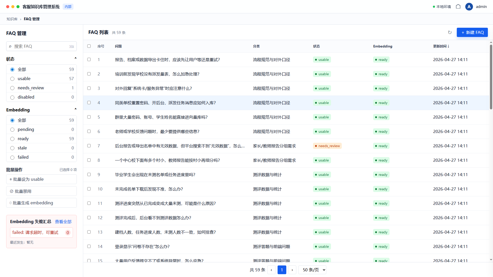
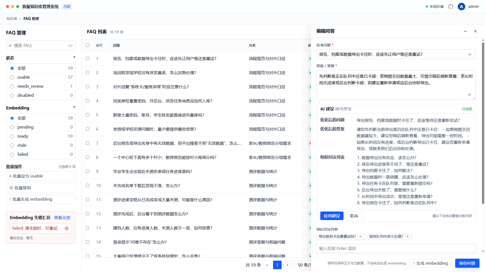

# Cyclops

本地优先的知识库与智能问答工作台。

Cyclops 面向需要沉淀业务知识、客服话术、产品资料和 SOP 的团队，把分散在 FAQ、PDF、Word、Excel、Markdown 和聊天记录里的信息，整理成可检索、可追溯、可审核的知识资产，并在此基础上生成更可靠的智能问答结果。

它不是一个只会把资料丢进模型的聊天壳。Cyclops 强调的是一条完整链路：资料进入系统后先解析、切块、审核，再生成向量并参与检索；每一次回答都尽量保留来源证据和调试线索，让知识库可以被长期维护，也能被团队真正信任。

## 为什么需要 Cyclops

业务知识通常不会整齐地待在一个地方。

一部分在客服 FAQ 里，一部分在产品手册里，一部分在运营表格里，还有大量细节散落在历史聊天记录、群公告和临时文档中。传统知识库可以存放这些内容，但很难回答具体问题；普通 RAG 应用可以生成答案，却经常缺少审核、来源和运营后台。

Cyclops 把这两件事合在一起：既是知识库后台，也是面向问答场景的检索与生成控制台。

## 核心能力

**从资料到知识**

上传 PDF、Word、Excel、Markdown 或聊天记录后，Cyclops 会围绕内容结构进行解析和切块，保留文件名、章节、页码、表格行、消息时间等来源线索。资料不会直接变成可回答内容，而是先进入审核与整理流程。

**从知识到检索**

确认后的 FAQ 和文档切片会进入统一知识单元，生成 embedding 后参与向量检索。知识来源不再割裂，标准问答、手册段落、SOP 说明和历史对话都可以成为同一套问答系统的证据。

**从检索到答案**

智能问答页面围绕真实排查流程设计：左侧是会话，中央是问答流，右侧是检索来源、调试过程和快速导览。团队可以看到答案为什么这样生成，也能定位需要补充或修正的知识。

**从配置到上线**

Cyclops 支持 OpenAI-compatible Chat / Embedding 接口，适配不同模型服务；同时保留数据库、解析服务、微信服务等配置入口，适合从本地验证逐步走向团队内部服务。

## 产品亮点

- 本地优先：知识库、配置和上传资料以本地部署为核心，适合内部业务资料场景。
- 审核优先：AI 解析结果默认不直接进入正式知识库，减少错误内容污染检索结果。
- 来源可追溯：回答和知识切片保留来源证据，便于复核、纠错和团队协作。
- 面向运营：FAQ、文档、问答、评测、知识图谱和设置统一在一个后台中管理。
- 问答可调试：检索命中、上下文组织、回答生成过程可以被观察和优化。
- 前端按需加载：管理后台按页面拆分资源，减少首屏负载，适合长期扩展更多工作区。

## 适合场景

- 客服团队整理常见问题、标准话术和产品说明。
- 运营团队把手册、流程、注意事项沉淀成可问答知识库。
- 产品团队验证 RAG 检索、答案生成和来源引用质量。
- 内部团队把微信、文档和表格中的业务经验沉淀为可复用知识。
- 需要在模型接入前保留人工审核和证据链的知识密集型场景。

## 页面预览

## 当前定位

Cyclops 当前更适合作为团队内部知识库与 RAG 运营后台，而不是公开互联网客服机器人。它关注的是知识整理、检索质量、答案可解释性和内部服务集成，为后续面向 C 端开放提供更干净、更可靠的知识基础。
